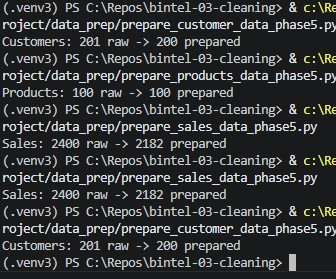
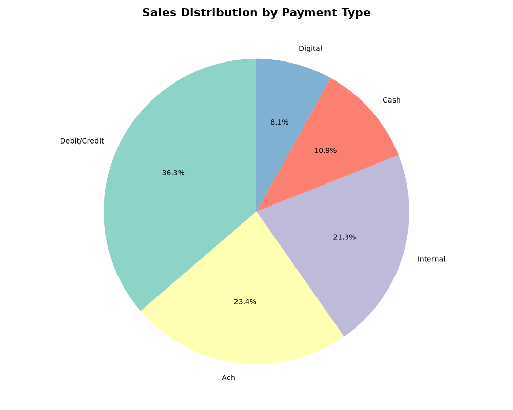

# Project Documentation

This site provides project documentation.
Use the documentation navigation to explore.

## How-To Guide

Many instructions are common to all our projects.

See
[⭐ **Workflow: Apply Example**](https://denisecase.github.io/pro-analytics-02/workflow-b-apply-example-project/)
to get the example projects running on your machine.

## Project Documentation Pages (docs/)

- **Home** - this documentation landing page
- [**Project Instructions**](./project-instructions.md)  - the standard project workflow
- [**Your Files**](./your-files.md) - how to copy the example and create your version
- [**Glossary**](./glossary.md) - project terms and concepts
- [**API**](./api.md) - autogenerated code documentation for the public project interface

## Phase 4. CJ Jade's Technical Modification

Week 3's Project was centered around BI cleaning of raw data, and processing that data into what we named as "prepared" files.

- The modification that was made was taking the data from the bar graph, and converting that data into a pie chart. The pie chart was then labeled, and displayed the percentages of each region.
- When looking at sales and regions knowing numbers can help give a better picture, when you move into goals and storytelling.
- One way I verified that my modification worked, was by ensuring there were no problems. After that I ran the code, when the new chart appear I knew the code had worked.
- The biggest result was that running this code properly created a third chart, which showed the sales of each regions and their percentages.
- The biggest challenged faced this week, was ensuring that the codes were written correctly. This took some time, and a lot of research from YouTube, CoPilot, and even REDDIT.

## Phase 5. Week 3's Custom Project Basics

The custom modification was done in a couple different parts. The first part was done earlier this week, during the analysis of the data. Two new columns were created for each one of the datasets.

The custom project I took on was creating a pie chart to show the percentages of the different payment types. The reason I did this, was because it's vital for businesses to keep track of this data.
It helps to anticipate and/or evaluate buying trends by knowing how and when customers are using certain types of payment tenders.

### CJ Jade's Data Files Descriptions

- customers_data.csv: this file gives the basic customer information, such as name, region, join date, spending score and tier level.
- products_data.csv: this file gives information on the products such as name, category, unit price, stock quantity, and stock status
- sales_data.csv: this files gives sales information such as customer ID, product ID, Sale date, transaction, store ID, sale amount, discount amount, and payment type.

### Cleaning Approach

What cleaning took place within the data sets?

- Removing Duplicates
- Formatting Columns and Rows
- Standardizing Columns and Rows
- Computing and/or Converting Numerical Data
- Removing Invalid Data
- Removing/Converting Missing Data

### Before and After

- Customer raw data was 201, cleaned is 200
- Products raw data was 100, cleaned is 100
- Sales raw data was 2400, cleaned 2182

### Real-World Thoughts & Quality Control

- Cleaning data is one of the most vital steps of processing data.
- This process not only takes time, but it also takes concentration, and high levels of detail. No matter the field cleaning data is an important aspect of everyday business life.
- **Just remember,** if the data is inaccurate then the results will be **wrong**---and that can cost the business a lot of money when making decisions down the road.

### Final Thoughts

Cleaning data takes a lot of time, this should be common knowledge.
There are many programs outside making codes in python. My preferred method is Tableau or Excel.
The important take away, is that cleaning the data should be a high priority. There should be no short cuts, because you'll want it done correctly the first time.
Humans are humans, mistakes will happen but that's why you create checkpoints. Finding a mistake early can save money, and maybe even a project.

### Images

